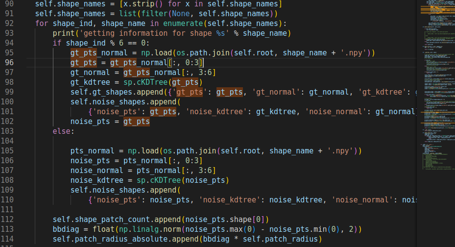
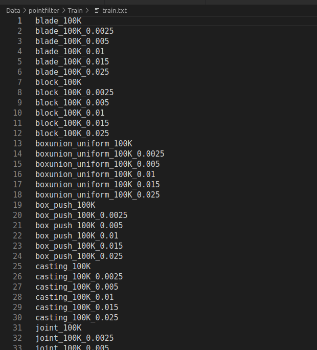

## PCDNF复现
安装依赖：
参考官方的README.md安装依赖。

### 准备数据集
- 下载数据集，解压到指定目录。
- pointfilter数据集似乎已经失效,本地找找

本次使用的dataset是mpeg
1. 建立文件 trainset/train.txt
train.txt 格式如下：(参考dataset923.py=>class PointcloudPatchDataset(data.Dataset):
)


```
gt_file_path0_0 # 每六个一个循环
noise0_1
noise0_2
noise0_3 
noise0_4
noise0_5
gt_file_path0_1

```

1.1 建立train.txt的内容
使用的文件: ***util-self/addNoise.sh => addNoise-pcdnf.py***
直接把数据送到trainset文件夹下, 然后在1.2中把数据路径写入train.txt
- ends with .npy的文件
- 那么噪声有5种:目前打算就按照pcdnf的(0.0025 0.005 0.01 0.015 0.025)
> 因为这个噪声还挺小的 !! pcdnf选择的这个效果测试可能不错

1.2 划分dataset => trainset/train.txt
使用的文件: ***PCDNF/selfutil/make_traintxt.py***
> 读取数据: dataset923.py: opt.root + shapename里面的each line. 

训练集:  (longdress,loot,redandblack)
<!-- 目前考虑 3类 for train. -->
验证集:  (soldier)

> 目前看来似乎没有test的部分?只有testN.py有evaluate的部分.. dataset923.py中有"evaluation"


```
python make_traintxt.py
```

2. **计算normal**
```python
python PCDNF/selfutil/open3d-normal.py
```
输入Nx3的npy文件或者xyz文件,输出Nx6的npy文件,后3维为normal

normal的计算使用了open3d.geometry.PointCloud.estimate_normals()方法,直接使用默认参数测试了效果可以,论文中是说使用的是PCA方法,但是没有给具体的代码,open3d的estimate_normals()方法看了实现是svd计算特征值的,似乎可以.

得到了trainset/train.txt和trainset下的*.npy文件(Nx6), 准备训练.
### 训练
之后可以参考
```python
python train_Network1.py
```
### 介绍
