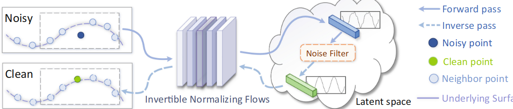
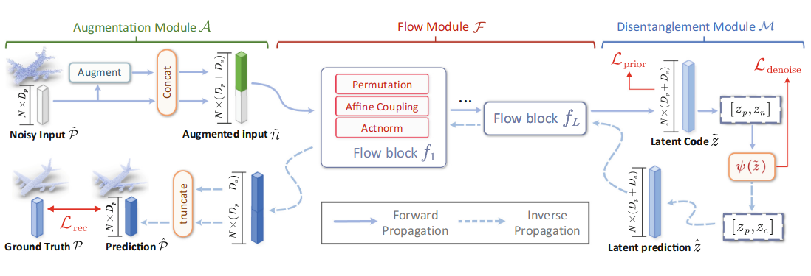
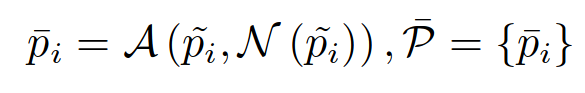
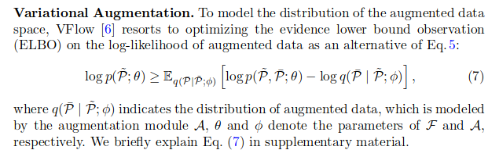
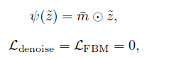
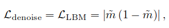
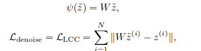
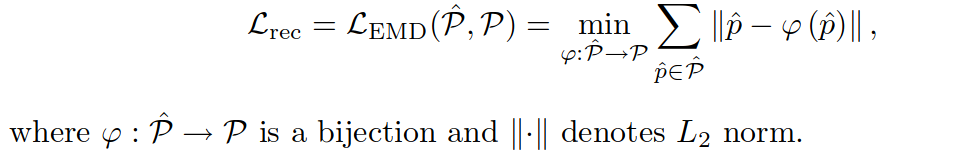
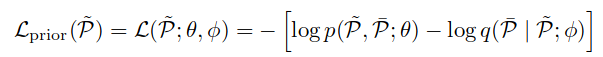
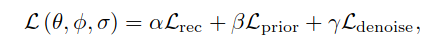

## Pdflow 二看

### Abstract

* 使用了normalize flow and noise disentanglement technique

* Distribution learn and feature distanglement

* 通过归一化流来对欧几里得空间和潜在空间之间的映射进行建模

### Introduction

介绍了传统技术优缺点, 以及现在的dl技术

1. Regress points, predictint displacesments(PointCleanNet, PointFilter), or progressive movement (Score-Denoise)

作者认为上述的方法有缺点: 点特征是独立地从局部感受野中提取的。因此，邻域点之间可能无法保留一致的表面属性，从而导致伪影，例如离群值和散点

* 先downsample, 然后 resampling/upsampling,(如TotalDenoise,Differentiable manifold reconstruction)

缺点: 丢失细节

作者认为: **噪声点云视为 3D 形状和损坏噪声的联合分布的样本**

所以: 点云去噪问题 = 将干净部分与其潜在表示分离

> 我们还可以从信号处理的角度来解释这个想法\[36]，其中干净点和噪声分别类似于信号的低频和高频部分。我们可以过滤掉高频内容，并通过对原始信号的主要信息进行编码的低频部分来恢复平滑的信号

**本文实现的方法:**

1. 通过将点编码为潜在表示来学习噪声点云的分布

2. 从潜在表示中过滤掉噪声部分

3. 从潜在表示中解码/恢复无噪声点干净的潜在代码

因此作者使用了NFs,整体流程如下

为什么使用NFs?

1. NF能够将复杂的分布转换为解缠结的代码空间，这是点云去噪任务所需的属性，

2. NF是可逆且无损的传播过程，它确保点云与其潜在表示之间的一对一映射，&#x20;

3. NF在统一的框架中实现编码和解码过程，并在前向和反向传播之间共享权重。

Main contribution

* pdflow这个方法,

* augment vanilla flow , (增强普通流这个方法?)

  * 后面会详细讲, 就是增强表现的信息量?

* 验证效果好

### &#x20;Related work

**Traditional Denoising Methods**: MLS, jetting fitting ,各种 filter方法, neighborhood-based fitering method, Graph-based&#x20;

**Deep-Learning-Based Denoising Methods:** PointCleanNet, Total Denoise, GPDnet, DMRnet, ScoreDenoise

作者认为自己提出的方法不同的点: &#x20;

1. 我们将去噪过程表述为从噪声输入的因式分解表示中分离出噪声。

2. 我们没有应用单独的模块来提取高级特征和重建坐标，而是将点编码/解码过程与双射网络设计统一起来。

#### 2.2 Normalizing Flows for Point Cloud Analysis

介绍了一下NFs

> 是什么,有什么用,现在用到了什么地方,运用广泛... 代表model: DNF(discrete NFs), CNF (continuous NFs)

介绍了现有的NFs论文

> 第一个NFs用于点云的方法PointFlow是用于point cloud generation的,后面就是一些Related Work,

总结: 都不太行

> These works mainly focus on improving generative ability and are evaluated on toy datasets.There are few works concentrating on flowbased real-world point cloud applications

然后自己first提出的, good!&#x20;

> we take advantage of the invertible capacity of NFs, which enable exact latent variable inference and efficient clean point synthesis.

### Method

#### 3.1 Overview

作者对于噪声以及去除的定义:&#x20;

给定一个输入点集 $\tilde{P} = {\tilde{p}_i = p_i + o_i} \in \mathbb{R}^{N \times D_p}$，该点集受到噪声$O ={o_i}$ 的影响，我们的目标是预测一个干净点集 $\hat{P} = {\hat{p}_i} \in \mathbb{R}^{N \times D_p}$，其中 $N$是点的数量，$D_p$ 是点的坐标维度，$\hat{p}_i$ 是干净点 $p_i$ 的预测值, 不对Noise 分布做出预测

最关键的word:

利用 NF 对欧几里得空间和潜在空间之间的点分布映射进行建模

#### 3.2 Flow-based Denoising Method

1. 问题描述：

   * 描述了点云去噪问题的基本设定，假设了噪声点集的分布是干净点集和噪声的联合分布。

   * 目标是学习一个参数化的双射映射函数 $f_{\theta}$，以近似数据分布。

   * 引入了一个随机变量 $\tilde{z}$，其概率密度已知，且满足分解分布的形式，表示为 $p_{\theta}(\tilde{z}) = \prod_{i} p_{\theta}(\tilde{z}_i)$。

2. 解缠表示：

   * 假设 $f_{\theta}$ 能够同时学习嵌入噪声因子和点云的内在结构到一个解缠的潜在代码空间。

   * 使用解缠函数 $\psi(\tilde{z})$ 在潜在空间中定义了一个估计的干净表示 $\hat{z}$。

3. 点云重构：

   * 基于解缠表示，通过逆变换 $g_{\theta}(\hat{z})$ 得到干净点样本 $\hat{P}$。

4. 正规化流模型：

   * 描述了 $f_{\theta}$ 由一系列可逆变换 $f_{1\theta}, \ldots, f_{L\theta}$ 组成的结构，称为正规化流。

   * 使用 $h_l$ 表示第 $l$ 层的输出，定义了正规化流的迭代过程。

5. 概率密度估计：

   * 应用变量变换公式和链式法则，得到了对于 $\tilde{P}$ 的输出概率密度的计算公式。

   * 公式中包含了变换 $f_{\theta}$ 的 Jacobian 矩阵的行列式的对数绝对值，用来衡量 $f_{\theta}$ 引起的体积变化。

6. 训练方法：

   * 使用最大似然原则对 $f_{\theta}$ 进行训练，使用梯度下降技术。

#### 3.3 Augmentation Module

Dimensional Bottleneck: 输入$D_P$维度,输出也是一样的.&#x20;

用不了squeezing operator(designed for image manipulation), 只能想办法别squeezing的方法

Dimension Augmentation: 就增加维度,&#x20;

> for each input point    ̃$\tilde{p}_i \in \mathbb{R}^{D_p} \text{in } \tilde{P}$ , we augment it with a random variable $\bar{p}_i\in \mathbb{R}^{D_a}$

$N(\tilde{p}_i)$表示$\tilde p_i$的k个邻居,&#x20;

> 总而言之其实就是在原本Nx3的基础上变成了Nx(3+Da)

Variational Augmentation: 不太懂

总之, augment之后 传递的信息多了,自然效果就更好了

#### 3.4 Flow Module

流模块F的架构由L个块组成，其中每个块由几个流组件组成，如图3所示。每个组件都被设计为满足高效可逆性和易处理的雅可比行列式，包括仿射耦合层\[11]、actnorm \[25]和排列层\[25]。

#### 3.5 Disentanglement Module

* Fix Binary Mask (FBM)

将noise channel 设置为 0, 得到了$L_{fbm}=L_{denoise}$

* Learnable Binary Mask (LBM).

把FBM的$m$变成可以学习的参数,就是LBM了

* Latent Code Consistency (LCC)

最小化干净点和噪声点之间的潜在表示差异来实现, 将noisy 转化为 clean

#### 3.6 Joint loss Function&#x20;

1. Reconstruction Loss&#x20;

   就是 生成的点与 ground truth 的EMD value

   

2. Prior Loss

优化了流模块 F 的转换能力，通过最大化观察 ̃ P 的似然性来实现

最小化公式 (7) 中的负 ELBO 来实现

* Total Loss

Reconstruction loss

#### 3.7 Discussion

维度增强为正规化流（NFs）带来了三方面的好处：

1. 泛化能力增强：增强的正规化流是对标准正规化流的泛化，用户可以自由调整额外维度 Da 的数量，从而使模型能够更好地建模复杂函数。

2. 提高灵活性和表达能力：增强的维度为流变换之间的中间点特征提供了更大的灵活性和表达能力，避免了从头开始提取高维特征，有助于更好地捕捉数据的特征。

3. 增加噪声过滤自由度：增强的维度增加了解缠阶段噪声过滤的自由度，尤其对于原始点云只包含一个维度的情况下特别有帮助。

总而言之: 开销不大,效果不错

### Experiments

4.1 Dataset&#x20;

PUSet,

DMRset

4.2 Evaluation Metric

CD, HD, P2M&#x20;

Qualitative Comparison.

感觉没什么好说的,就是说看起来很好, 提供了一个figure6 以p2m为metrics 画了一个图,然后就看起来效果不错

还在real-world dataset *Paris-rue-Madame*上进行测试了&#x20;

4.3 Ablation Study

评估基于 PUSet 中 10K 个具有 2% 高斯噪声的点

&#x20;使用MLP替换 inverse propagation of $F$, 效果不好, 由此得知 , F is goooood!!&#x20;
