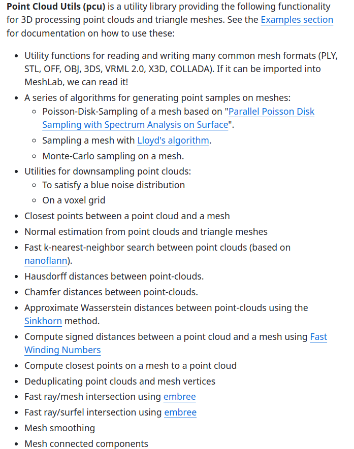
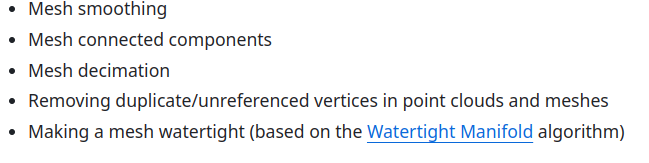

* Metrics, 各种评价指标:cd,hd,p2m

> 在pd-flow中有实现

他人使用pytorch 实现的[ ChamferDistance](https://github.com/ThibaultGROUEIX/ChamferDistancePytorch)


* [pytorch\_cluster](https://github.com/rusty1s/pytorch_cluster) 800stars 

包含functions

```python
Graclus,greddy cluster 算法
VoxelGrid
FarthestPointSampling, FPS
knn-graph
Radius-Graph
Nearest
RandomWalk-Sampling
```

* [point\_cloud\_utils](https://github.com/fwilliams/point-cloud-utils) 1.2k stars

```python
CD,HD
normal estimation
Fast-knn
```





